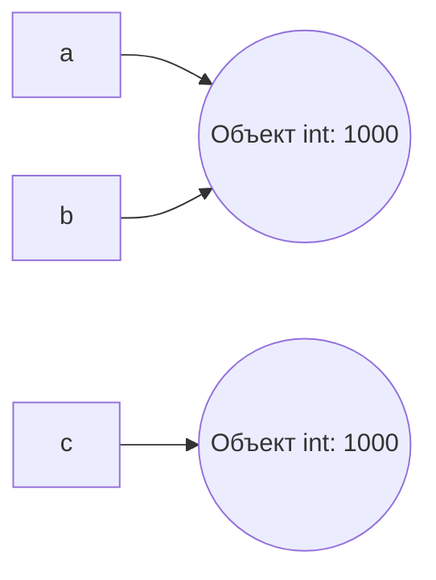

# Лабораторная работа №1. Выполнение программы, объекты и базовые типы Python.
### Задание №1. От исходного кода к байткоду.
1. В REPL выражения автоматически печатаются, потому что REPL сам вызывает отображение результата каждого выражения, в отличие от запуска файла. При запуске файла результат выражения не отображается, а чтобы увидеть результат, нужен явный вызов через `print()`.
2. С добавленным кодом выражениями является каждая строчка, инструкциями - инструкции присваивания `course = "Python"`, `hours = 4*2` и инструкция вызова функции `print(f"{course}: {hours} часов")`, литералами - строковые литералы "Python", " часов" и ": ", целочисленные литералы 4 и 2. При создании программы создаются имена `course` и `hours`.
3. Версия интерпретатора - 3.13.5.
  
  

  В AST узел присваивания - Assign, узел арифметических операций - BinOp() с операторами Add и Mult, узел вызова print() - Call с func=Name(id='print').
  В дизассемблированном коде инструкция, отвечающая за загрузку константы - LOAD_CONST, а за вызов функции - LOAD_NAME.
#### Контрольный вопрос:
Байткод - это набор инструкций для виртуальной машины CPython, а не для физического процессора. Инструкции по типу LOAD_CONST, BINARY_OP, STORE_NAME понимает только интерпретатор Python, а настоящий процессор - нет. Один и тот же байткод может выполняться на процессорах разной архитектуры при условии, что там установлен интерпретатор CPython. Машинный код - это другой уровень, состоящий из команд по типу mov, add, jmp, которые процессор выполняет напрямую.

### Задание 2. Имена, объекты и сравнение.
1.

2. Равенство значений `==` мы используем, чтобы проверить эквивалентность значений переменных, а идентичность объектов `is` - чтобы проверить, указывает ли переменная на один и тот же фрагмент памяти.
3. Корректная проверка: `print("c is None:", c is None)`. Через `==` тоже можно, но в этом мало смысла, поскольку объекты, инициализированные как `None`, всегда будут одним и тем же фрагментом памяти `None`.
4. Проверка `first == second` возвращает `True`, потому что содержимое обеих строк полностью совпадает. `first is second` тоже возвращает `True`, потому что из-за оптимизации компилятора Python second начинает указывать на тот же объект, что и `first`, сразу после склейки `"py"+"thon"`. Python сохраняет одинаковые строковые константы в памяти как один объект.
5. Мы применяем `==`, когда нужно сравнить именно значения переменных. Применять `is` желательно только тогда, когда мы работаем с `True`, `False` или `None`, чтобы в других случаях избежать путаницы.
#### Контрольные вопросы:
1. Нет, `b = a` не копирует объект, а создаёт новую ссылку, связывая её с уже существующим объектом. Обе переменные указывают на один и тот же элемент памяти.
2. `type()` возвращает класс указанного объекта, а `id()` - целочисленный идентификатор объекта (его адрес в памяти).
3. Оператор `is` проверяет идентичность, а оператор `==` сравнивает значения объектов. Объект None является синглтоном и всегда существует в памяти в единственном экземпляре, поэтому сравнивать переменные с ним через `is` корректно и безопасно. Числа и строки же могут иметь одинаковые значения, но физически находиться в разных объектах памяти, поэтому в таком случае лучше использовать `==`.

### Задание 3. Числовые типы, операции и преобразования.
Эксперимент A: `/` всегда возвращает `float`, потому что результат деления может быть нецелым числом, и Python не хочет терять точность. `//` возвращает целую часть от деления типа `int`.

Эксперимент B: В языках типа C, C++, Java `int` - это фиксированная разрядность, то есть когда значения выходят за предел происходит переполнение (можно сказать, идёт по второму или большему кругу внутри фиксированного отрезка чисел). В Python `int` произвольной точности - сколько нужно памяти под цифры, столько и будет выделено.

Эксперимент C: Компьютер хранит числа в двоичной системе, сохраняя их в виде "мантисса * 2^экспонента" (мантисса - конечная двоичная дробь), а число `0.1` в двоичной системе - бесконечно (`0.0001100110011001100110011...`). Python обрезает эту дробь до 53 бит мантиссы (стандарт double). По итогу получается приближённое значение. Складывая два таких приближения, получаем результат, который чуть-чуть не равен 0.3.
Правило безопасного сравнения: не стоит использовать `==`, вместо этого лучше импортировать библиотеку math и использовать `math.isclose(a, b)` - эта функция проверяет, что модуль разности меньше небольшого порога `1e-9`.

Эксперимент D: `"False"` - это непустая строка из пяти символов. Python не смотрит на её содержание, он смотрит только на длину. Если строка не пустая, нужно вывести `True`. Комплексное число `z = complex(2, -3)` имеет действительную часть `z.real = 2.0` и мнимую `z.imag = -3.0`, обе типа `float`.
#### Контрольные вопросы:
1. Деление может дать нецелый результат. Python принимает решение при использовании `/` всегда возвращать `float`, чтобы не терять точность. Если нужно сохранить `int`, то нужно использовать `//`.
2. `int("42")` преобразует строку в число, на выходе получаем число `42`. `int(42.9)` отбрасывает дробную часть, в результате тоже получаем `42`.
3. Только `bool(0)` и `bool("")` возвращают `False`. Остальные выражения из этого эксперимента возвращают `True`.

### Задание 4. Строки, Unicode и форматирование.
В пункте 8 при попытке изменить строку произошла ошибка содержания `TypeError: 'str' object does not support item assignment`. Это произошло потому, что строки в Python неизменяемые, после её создания нельзя изменить её элементы по индексу.
#### Контрольные вопросы:
1. Они могут различаться потому, что `len(symbol)` считает количество символов Unicode, а `len(symbol.encode("utf-8"))` - байты в кодировке UTF-8. Для латиницы и цифр эти значения совпадают (и равны 1), для кириллицы количество байтов равно 2, для иероглифов - 3, для эмодзи - 4.
2. `start` - индекс первого включаемого символа, `stop` - индекс, до которого идём, не включая его. `step` - шаг: 1 - по одному символу вперёд, 2 - через один, -1 - в обратном порядке. Если параметры не указаны: `start = 0`, `stop = конец строки`, `step = 1`.
3. Методы `.upper()`, `.lower()`, `.replace()` не изменяют исходный объект, а создают и возвращают новый. Исходная строка остается в памяти нетронутой. Неизменяемость означает, что нельзя поменять содержимое существующего объекта-строки, но можно создать на его основе новый. Если результат не сохранить (`student = student.upper()`), изменения потеряются, и переменная по-прежнему будет указывать на старый объект.

### Задание 5. Информационная карточка вычислительного эксперимента.
1. 
| Имя переменной | Тип после выполнения |
| ----------- | ----------- |
| researcher   | str   |
| experiment    | str   |
| runs_str   | str   |
| duration_str    | str   |
| real_str   | str   |
| imag_str    | str   |
| runs   | int   |
| duration    | float   |
| real   | float   |
| imag    | float   |
| total_seconds   | float   |
| total_minutes    | float   |
| coefficient   | complex   |
| modulus_squared    | float   |
| has_runs   | bool   |
2. Возьмём строку `total_seconds = runs * duration`. Литералов нет, имена: `runs` (тип `int`), `duration` (тип `float`), `total_seconds` (новое имя, создаётся этим присваиванием), операторы: `=` (присваивание), `*` (умножение), вызовов функций нет.
3. Исходный файл task_5.py -> Python читает текст -> строит AST -> компилирует в байткод -> виртуальная машина CPython выполняет байткод инструкция за инструкцией.
При вызове `input()` ВМ читает строку из стандартного ввода; при `print()` пишет в стандартный вывод.
4. `input()` всегда возвращает строку, независимо от того, что ввёл пользователь. Строка не поддерживает арифметику: `"8" * 2` даст `"88"` (повтор строки), а `"8" + 2` вызовет `TypeError`. Чтобы получить число, нужно явно вызвать `int()` или `float()`.
#### Контрольный вопрос:
При повторном присваивании создаётся новый объект, а имя перепривязывается к нему. Старый объект остаётся в памяти, пока на него ссылается хотя бы одно имя; если ссылок нет - его удаляют. 
