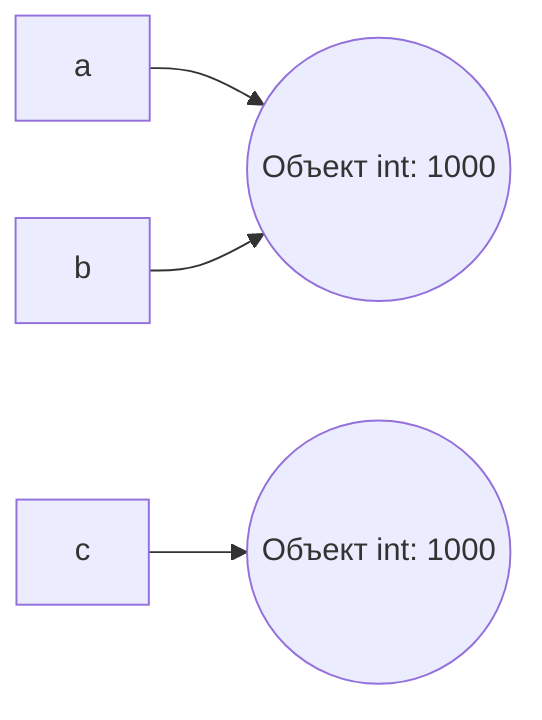

# Лабораторная работа №1. Выполнение программы, объекты и базовые типы Python.
### Задание №1. От исходного кода к байткоду.
1. В REPL выражения автоматически печатаются, потому что REPL сам вызывает отображение результата каждого выражения, в отличие от запуска файла. При запуске файла результат выражения не отображается, а чтобы увидеть результат, нужен явный вызов через `print()`.
2. С добавленным кодом выражениями является каждая строчка, инструкциями - инструкции присваивания `course = "Python"`, `hours = 4*2` и инструкция вызова функции `print(f"{course}: {hours} часов")`, литералами - строковые литералы "Python", " часов" и ": ", целочисленные литералы 4 и 2. При создании программы создаются имена `course` и `hours`.
3. Версия интерпретатора - 3.13.5.
  
  

  В AST узел присваивания - Assign, узел арифметических операций - BinOp() с операторами Add и Mult, узел вызова print() - Call с func=Name(id='print').
  В дизассемблированном коде инструкция, отвечающая за загрузку константы - LOAD_CONST, а за вызов функции - LOAD_NAME.
#### Контрольный вопрос:
Байткод - это набор инструкций для виртуальной машины CPython, а не для физического процессора. Инструкции по типу LOAD_CONST, BINARY_OP, STORE_NAME понимает только интерпретатор Python, а настоящий процессор - нет. Один и тот же байткод может выполняться на процессорах разной архитектуры при условии, что там установлен интерпретатор CPython. Машинный код - это другой уровень, состоящий из команд по типу mov, add, jmp, которые процессор выполняет напрямую.

### Задание 2. Имена, объекты и сравнение.
1.

2. Равенство значений (==) мы используем, чтобы проверить эквивалентность значений переменных, а идентичность объектов (is) - чтобы проверить, указывает ли переменная на один и тот же фрагмент памяти.
3. Корректная проверка: `print("c is None:", c is None)`. Через "==" тоже можно, но в этом мало смысла, поскольку объекты, инициализированные как `None`, всегда будут одним и тем же фрагментом памяти `None`.
4. Проверка `first == second` возвращает `True`, потому что содержимое обеих строк полностью совпадает. `first is second` тоже возвращает `True`, потому что из-за оптимизации компилятора Python second начинает указывать на тот же объект, что и `first`, сразу после склейки `"py"+"thon"`. Python сохраняет одинаковые строковые константы в памяти как один объект.
5. Мы применяем `==`, когда нужно сравнить именно значения переменных. Применять `is` желательно только тогда, когда мы работаем с True, False или None, чтобы в других случаях избежать путаницы.
#### Контрольные вопросы:
1. Нет, `b = a` не копирует объект, а создаёт новую ссылку, связывая её с уже существующим объектом. Обе переменные указывают на один и тот же элемент памяти.
2. `type()` возвращает класс указанного объекта, а `id()` - целочисленный идентификатор объекта (его адрес в памяти).
3. Оператор `is` проверяет идентичность, а оператор `==` сравнивает значения объектов. Объект None является синглтоном и всегда существует в памяти в единственном экземпляре, поэтому сравнивать переменные с ним через `is` корректно и безопасно. Числа и строки же могут иметь одинаковые значения, но физически находиться в разных объектах памяти, поэтому в таком случае лучше использовать `==`.
